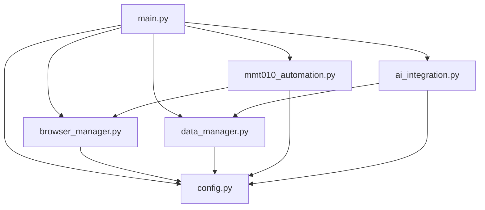

# MT151_MSEDGE API 文件

## 📋 目錄
1. [模組架構](#模組架構)
2. [核心類別](#核心類別)
3. [API參考](#api參考)
4. [配置項目](#配置項目)
5. [資料模型](#資料模型)
6. [錯誤處理](#錯誤處理)
7. [擴展開發](#擴展開發)

## 🏗️ 模組架構

### 專案結構
```
MT151_MSEDGE_REFACTORED/
├── src/                    # 核心程式碼
│   ├── main.py            # 主程式入口
│   ├── config.py          # 配置管理
│   ├── browser_manager.py # 瀏覽器管理
│   ├── data_manager.py    # 資料管理
│   ├── mmt010_automation.py # MMT010自動化
│   └── ai_integration.py  # AI整合
├── config/                # 配置檔案
├── docs/                  # 文件
├── tests/                 # 測試檔案
└── logs/                  # 日誌檔案
```

### 模組依賴關係


## 🎯 核心類別

### 1. MT151App (main.py)
主應用程式控制器

```python
class MT151App:
    """MT151_MSEDGE 主應用程式類別"""
    
    def __init__(self):
        """初始化應用程式"""
    
    async def run(self):
        """運行主程式"""
    
    async def start_browser_and_connect(self) -> bool:
        """啟動瀏覽器並連線到MMT010"""
    
    async def handle_data_management(self):
        """處理資料管理操作"""
    
    async def handle_ai_assistant(self):
        """處理AI助手操作"""
    
    async def cleanup(self):
        """清理資源"""
```

### 2. BrowserManager (browser_manager.py)
瀏覽器管理和控制

```python
class BrowserManager:
    """瀏覽器管理器"""
    
    def __init__(self, config: Optional[BrowserConfig] = None):
        """初始化瀏覽器管理器"""
    
    async def start_browser(self, choice: str = "auto") -> Optional[BrowserInfo]:
        """啟動瀏覽器"""
    
    async def navigate_to(self, url: str, wait_for_load: bool = True) -> bool:
        """導航到指定URL"""
    
    async def wait_for_login(self, login_url_pattern: str, timeout: int) -> bool:
        """等待用戶登入"""
    
    async def take_screenshot(self, path: Optional[str] = None) -> Optional[str]:
        """擷取螢幕截圖"""
    
    async def close(self):
        """關閉瀏覽器"""
```

### 3. DataManager (data_manager.py)
測試資料管理和驗證

```python
class DataManager:
    """資料管理類別"""
    
    def __init__(self, config: Optional[DataConfig] = None):
        """初始化資料管理器"""
    
    def input_test_data(self, is_edit: bool = False, 
                       existing_data: Optional[TestData] = None) -> Optional[TestData]:
        """讓用戶輸入測試資料"""
    
    def validate_data(self, data: TestData) -> ValidationResult:
        """驗證單筆資料"""
    
    def save_data(self, backup: bool = True) -> bool:
        """儲存資料到檔案"""
    
    def load_data(self) -> bool:
        """從檔案載入資料"""
    
    def find_duplicates(self, target_data: TestData, threshold: float = 0.8) -> List[TestData]:
        """尋找重複或相似的資料"""
```

### 4. MMT010Automation (mmt010_automation.py)
MMT010系統自動化操作

```python
class MMT010Automation:
    """MMT010自動化操作類別"""
    
    def __init__(self, page: Page, config: Optional[WebConfig] = None):
        """初始化自動化操作"""
    
    async def navigate_to_mmt010(self) -> bool:
        """導航到MMT010系統"""
    
    async def add_new_test_data(self, test_data: TestData) -> bool:
        """新增測試資料到表格"""
    
    async def edit_test_data(self, row_identifier: Union[int, str], 
                           test_data: TestData) -> bool:
        """編輯測試資料"""
    
    async def delete_test_data(self, row_identifier: Union[int, str]) -> bool:
        """刪除測試資料"""
    
    async def view_test_data(self) -> Dict[str, Any]:
        """查看現有測試資料"""
    
    async def batch_add_test_data(self, test_data_list: List[TestData]) -> Dict[str, Any]:
        """批量新增測試資料"""
```

### 5. AIAssistant (ai_integration.py)
AI智能助手整合

```python
class AIAssistant:
    """AI助手主類"""
    
    def __init__(self, config: Optional[AIModelConfig] = None):
        """初始化AI助手"""
    
    async def smart_data_validation(self, test_data: List[Dict[str, Any]]) -> Dict[str, Any]:
        """智能資料驗證"""
    
    async def suggest_next_action(self, current_context: Dict[str, Any]) -> str:
        """根據當前上下文建議下一步動作"""
    
    async def help_with_error(self, error_message: str, 
                            context: Optional[str] = None) -> str:
        """協助處理錯誤"""
    
    async def interactive_chat(self):
        """互動式聊天"""
```

## 📖 API參考

### 配置管理 API

#### 獲取配置
```python
from config import get_config, get_browser_config, get_data_config

# 獲取完整配置
app_config = get_config()

# 獲取特定配置
browser_config = get_browser_config()
data_config = get_data_config()
web_config = get_web_config()
ai_config = get_ai_config()
```

#### 自訂配置
```python
from config import ConfigManager

# 使用自訂配置檔案
config_manager = ConfigManager("path/to/custom_config.json")
config = config_manager.load_config()

# 更新配置
config_manager.update_config(debug_mode=True, auto_save=False)
```

### 瀏覽器管理 API

#### 基本使用
```python
from browser_manager import BrowserManager

# 建立瀏覽器管理器
manager = BrowserManager()

# 啟動瀏覽器
browser_info = await manager.start_browser("auto")

# 導航到網站
success = await manager.navigate_to("https://example.com")

# 等待登入
login_success = await manager.wait_for_login()

# 擷取截圖
screenshot_path = await manager.take_screenshot()

# 關閉瀏覽器
await manager.close()
```

#### 瀏覽器選擇
```python
from browser_manager import BrowserSelector

selector = BrowserSelector()

# 顯示選單
selector.show_menu()

# 獲取用戶選擇
choice = selector.get_user_choice()

# 啟動指定瀏覽器
browser_info = await selector.launch_browser(playwright, choice)
```

### 資料管理 API

#### 基本操作
```python
from data_manager import DataManager, TestData

# 建立資料管理器
manager = DataManager()

# 建立測試資料
test_data = TestData(
    料號="C08GL0DIG017A",
    站位="B/I",
    版本="V3.3.5.9_1.16.0.1E3.12-1",
    描述="EN0DIGOA1-0322-GL_HL-325L B/I"
)

# 驗證資料
validation_result = manager.validate_data(test_data)
print(f"有效: {validation_result.is_valid}")
print(f"分數: {validation_result.score}")

# 儲存資料
manager.current_dataset.append(test_data)
manager.save_data()

# 載入資料
manager.load_data()
```

#### 進階操作
```python
# 批量輸入
batch_data = manager.input_batch_test_data()

# 尋找重複
duplicates = manager.find_duplicates(test_data)

# 搜尋資料
results = manager._handle_search_operation()

# 匯出資料
export_result = manager._handle_export_operation()
```

### MMT010自動化 API

#### 基本自動化
```python
from mmt010_automation import MMT010Automation

# 建立自動化操作物件
automation = MMT010Automation(page)

# 導航到MMT010
await automation.navigate_to_mmt010()

# 等待登入
await automation.wait_for_login()

# 基本操作
await automation.click_search_button()
await automation.click_save_all_button()
```

#### 表格操作
```python
# 新增測試資料
success = await automation.add_new_test_data(test_data)

# 編輯資料（依行號）
success = await automation.edit_test_data(1, test_data)

# 編輯資料（依內容）
success = await automation.edit_test_data("C08GL0DIG017A", test_data)

# 刪除資料
success = await automation.delete_test_data(1)

# 查看表格資料
result = await automation.view_test_data()
print(f"總行數: {result['row_count']}")

# 批量新增
batch_result = await automation.batch_add_test_data([test_data1, test_data2])
print(f"成功率: {batch_result['success_rate']:.1%}")
```

#### 進階功能
```python
# 獲取表格資訊
grid_info = await automation.get_grid_info()

# 尋找特定行
row_locator = await automation.find_grid_row(2)

# 填寫單個儲存格
success = await automation.fill_single_cell(row_locator, "料號", "NEW_PART")

# 除錯頁面結構
debug_info = await automation.debug_page_structure()

# 擷取截圖
screenshot_path = await automation.take_screenshot("debug.png")
```

### AI整合 API

#### 基本AI功能
```python
from ai_integration import AIAssistant, AIModelConfig

# 配置AI模型
ai_config = AIModelConfig(
    model_name="gpt-4",
    temperature=0.7,
    max_tokens=2000
)

# 建立AI助手
assistant = AIAssistant(ai_config)

# 資料驗證
validation_result = await assistant.smart_data_validation([data1, data2])

# 獲取操作建議
context = {"current_status": "browser_connected"}
suggestion = await assistant.suggest_next_action(context)

# 錯誤診斷
help_text = await assistant.help_with_error("Element not found", "table operation")
```

#### 便利函數
```python
from ai_integration import quick_analyze, quick_chat

# 快速分析
analysis = await quick_analyze(test_data.to_dict())

# 快速聊天
response = await quick_chat("如何新增測試資料？")
```

## ⚙️ 配置項目

### 應用配置 (AppConfig)
```python
class AppConfig:
    version: str                    # 應用版本
    app_name: str                  # 應用名稱
    description: str               # 應用描述
    auto_save: bool               # 自動儲存
    confirm_destructive_actions: bool  # 確認破壞性操作
    max_retry_attempts: int       # 最大重試次數
    retry_delay: float           # 重試延遲
    debug_mode: bool             # 除錯模式
    verbose_logging: bool        # 詳細日誌
```

### 瀏覽器配置 (BrowserConfig)
```python
class BrowserConfig:
    default_browser: str         # 預設瀏覽器: "msedge", "chrome", "firefox"
    headless: bool              # 無頭模式
    slow_mo: int               # 操作延遲（毫秒）
    timeout: int               # 超時時間（毫秒）
    viewport_width: int        # 視窗寬度
    viewport_height: int       # 視窗高度
    user_data_dir: Optional[str]  # 用戶資料目錄
    chrome_args: List[str]     # Chrome參數
```

### 資料配置 (DataConfig)
```python
class DataConfig:
    default_test_data: Dict[str, str]    # 預設測試資料
    validation_rules: Dict[str, Dict]    # 驗證規則
    data_file_path: str                  # 資料檔案路徑
    backup_data_path: str               # 備份目錄
    batch_size: int                     # 批量大小
    batch_delay: float                  # 批量延遲
```

### 網站配置 (WebConfig)
```python
class WebConfig:
    base_url: str                       # MMT010基礎URL
    login_timeout: int                  # 登入超時（毫秒）
    page_load_timeout: int             # 頁面載入超時
    element_timeout: int               # 元素等待超時
    selectors: Dict[str, str]          # CSS選擇器
    column_mapping: Dict[str, int]     # 欄位映射
```

### AI配置 (AIConfig)
```python
class AIConfig:
    default_model: str              # 預設AI模型
    provider: str                   # AI提供者
    temperature: float              # 回應溫度
    max_tokens: int                # 最大代幣數
    timeout: int                   # 請求超時
    zen_server_enabled: bool       # 是否啟用zen-mcp-server
    zen_server_path: Optional[str] # zen-mcp-server路徑
    enable_data_analysis: bool     # 啟用資料分析
    enable_error_diagnosis: bool   # 啟用錯誤診斷
    enable_chat_assistance: bool   # 啟用聊天助手
    prompts: Dict[str, str]       # AI提示詞
```

## 📊 資料模型

### TestData
```python
class TestData(BaseModel):
    料號: str = Field(..., description="產品料號")
    站位: str = Field(..., description="測試站位")
    版本: str = Field(..., description="軟體版本")
    描述: str = Field(..., description="產品描述")
    MFGID群組: str = Field(default="DEFAULT", description="製造群組")
    
    # 元資料
    created_at: Optional[datetime] = Field(default_factory=datetime.now)
    updated_at: Optional[datetime] = Field(default_factory=datetime.now)
    source: str = Field(default="manual", description="資料來源")
    
    def to_dict(self) -> Dict[str, str]:
        """轉換為字典"""
    
    @validator('料號')
    def validate_part_number(cls, v):
        """驗證料號格式"""
    
    @validator('站位')
    def validate_station(cls, v):
        """驗證站位值"""
```

### ValidationResult
```python
class ValidationResult(BaseModel):
    is_valid: bool                      # 是否有效
    errors: List[str] = []             # 錯誤列表
    warnings: List[str] = []           # 警告列表
    suggestions: List[str] = []        # 建議列表
    score: float = 0.0                 # 品質分數 0-100
```

### BrowserInfo
```python
class BrowserInfo:
    browser: Union[Browser, BrowserContext]  # 瀏覽器物件
    page: Page                              # 頁面物件
    browser_type: str                       # 瀏覽器類型
    name: str                              # 瀏覽器名稱
    mode: str                              # 模式: "normal", "persistent"
    temp_dir: Optional[str]                # 臨時目錄
    
    async def close(self):
        """關閉瀏覽器"""
```

### AIResponse
```python
class AIResponse(BaseModel):
    success: bool                           # 是否成功
    content: str                           # 回應內容
    model_used: str                        # 使用的模型
    token_usage: Optional[Dict[str, int]]  # 代幣使用量
    error: Optional[str]                   # 錯誤訊息
```

## 🚨 錯誤處理

### 異常類型

#### 瀏覽器相關異常
```python
# Playwright內建異常
from playwright.async_api import TimeoutError, Error

try:
    await page.click("#button")
except TimeoutError:
    print("元素點擊超時")
except Error as e:
    print(f"Playwright錯誤: {e}")
```

#### 資料驗證異常
```python
from pydantic import ValidationError

try:
    test_data = TestData(**data_dict)
except ValidationError as e:
    print(f"資料驗證失敗: {e}")
```

#### 配置相關異常
```python
try:
    config = get_config()
except FileNotFoundError:
    print("配置檔案不存在")
except json.JSONDecodeError:
    print("配置檔案格式錯誤")
```

### 錯誤處理模式

#### 重試機制
```python
async def retry_operation(operation, max_attempts=3, delay=2.0):
    """重試操作的通用函數"""
    for attempt in range(max_attempts):
        try:
            return await operation()
        except Exception as e:
            if attempt == max_attempts - 1:
                raise e
            await asyncio.sleep(delay)
```

#### 優雅降級
```python
async def safe_operation(operation, fallback_value=None):
    """安全執行操作，失敗時返回預設值"""
    try:
        return await operation()
    except Exception as e:
        logging.warning(f"操作失敗，使用預設值: {e}")
        return fallback_value
```

### 日誌記錄

#### 設定日誌
```python
import logging

# 基本設定
logging.basicConfig(
    level=logging.INFO,
    format='%(asctime)s - %(name)s - %(levelname)s - %(message)s',
    handlers=[
        logging.FileHandler('logs/app.log'),
        logging.StreamHandler()
    ]
)

logger = logging.getLogger(__name__)
```

#### 使用日誌
```python
# 不同級別的日誌
logger.debug("除錯資訊")
logger.info("一般資訊")
logger.warning("警告訊息")
logger.error("錯誤訊息")
logger.critical("嚴重錯誤")

# 異常日誌
try:
    risky_operation()
except Exception as e:
    logger.exception("操作失敗")  # 自動記錄堆疊追蹤
```

## 🔧 擴展開發

### 添加新的自動化操作

#### 1. 擴展MMT010Automation
```python
class ExtendedMMT010Automation(MMT010Automation):
    """擴展的MMT010自動化類別"""
    
    async def custom_operation(self, parameters):
        """自訂操作"""
        try:
            # 實現自訂邏輯
            result = await self._perform_custom_action(parameters)
            return {"success": True, "result": result}
        except Exception as e:
            self.logger.error(f"自訂操作失敗: {e}")
            return {"success": False, "error": str(e)}
    
    async def _perform_custom_action(self, parameters):
        """執行自訂動作的內部方法"""
        # 具體實現
        pass
```

#### 2. 註冊新操作到主程式
```python
# 在main.py中添加新選單項目
def show_extended_menu(self):
    print("  10. 🔧 自訂操作")

async def handle_custom_operation(self):
    """處理自訂操作"""
    if isinstance(self.automation, ExtendedMMT010Automation):
        result = await self.automation.custom_operation(parameters)
        if result["success"]:
            print("✅ 自訂操作成功")
        else:
            print(f"❌ 自訂操作失敗: {result['error']}")
```

### 添加新的AI功能

#### 1. 擴展AI客戶端
```python
class ExtendedZenMCPClient(ZenMCPClient):
    """擴展的zen-mcp-server客戶端"""
    
    async def custom_ai_analysis(self, data: Dict[str, Any]) -> AIResponse:
        """自訂AI分析功能"""
        prompt = f"""
        執行自訂分析：
        資料: {json.dumps(data, ensure_ascii=False)}
        
        請提供：
        1. 自訂分析結果
        2. 特殊建議
        3. 風險評估
        """
        
        return await self._call_ai_tool("analyze", {
            "content": prompt,
            "focus": "custom_analysis"
        })
```

#### 2. 添加新的資料驗證規則
```python
class CustomDataManager(DataManager):
    """自訂資料管理器"""
    
    def validate_custom_rules(self, data: TestData) -> ValidationResult:
        """自訂驗證規則"""
        result = super().validate_data(data)
        
        # 添加自訂驗證邏輯
        if self._check_custom_condition(data):
            result.warnings.append("自訂條件警告")
            result.score -= 10
        
        return result
    
    def _check_custom_condition(self, data: TestData) -> bool:
        """檢查自訂條件"""
        # 實現自訂檢查邏輯
        return False
```

### 添加新的配置選項

#### 1. 擴展配置模型
```python
class ExtendedConfig(AppConfig):
    """擴展的應用配置"""
    
    # 新增自訂配置區塊
    custom: Dict[str, Any] = Field(default_factory=dict)
    
    # 新增特定功能配置
    advanced_features: bool = False
    custom_timeout: int = 30000
```

#### 2. 更新配置管理器
```python
class ExtendedConfigManager(ConfigManager):
    """擴展的配置管理器"""
    
    def load_extended_config(self) -> ExtendedConfig:
        """載入擴展配置"""
        if self.config_path.exists():
            with open(self.config_path, 'r', encoding='utf-8') as f:
                config_data = json.load(f)
            return ExtendedConfig(**config_data)
        return ExtendedConfig()
```

### 集成測試

#### 單元測試範例
```python
import pytest
from src.data_manager import DataManager, TestData

class TestDataManager:
    """資料管理器測試"""
    
    def setup_method(self):
        """測試前設置"""
        self.manager = DataManager()
    
    def test_create_valid_test_data(self):
        """測試建立有效測試資料"""
        data = TestData(
            料號="C08GL0DIG017A",
            站位="B/I",
            版本="V3.3.5.9_1.16.0.1E3.12-1",
            描述="Test description"
        )
        
        result = self.manager.validate_data(data)
        assert result.is_valid
        assert result.score > 80
    
    def test_invalid_part_number(self):
        """測試無效料號"""
        with pytest.raises(ValueError):
            TestData(
                料號="INVALID",  # 太短
                站位="B/I",
                版本="V3.3.5.9_1.16.0.1E3.12-1",
                描述="Test description"
            )
```

#### 整合測試範例
```python
import pytest
from playwright.async_api import async_playwright

class TestIntegration:
    """整合測試"""
    
    @pytest.mark.asyncio
    async def test_browser_automation_flow(self):
        """測試瀏覽器自動化流程"""
        async with async_playwright() as p:
            # 啟動瀏覽器
            manager = BrowserManager()
            browser_info = await manager.start_browser("auto")
            
            assert browser_info is not None
            assert browser_info.page is not None
            
            # 測試導航
            success = await manager.navigate_to("https://example.com")
            assert success
            
            # 清理
            await manager.close()
```

### 部署和打包

#### 建立執行檔
```python
# setup.py
from setuptools import setup, find_packages

setup(
    name="mt151-msedge",
    version="2.0.0",
    packages=find_packages(),
    install_requires=[
        "playwright>=1.40.0",
        "pydantic>=2.0.0",
        "requests>=2.31.0",
    ],
    entry_points={
        "console_scripts": [
            "mt151-msedge=src.main:main",
        ],
    },
)
```

#### Docker容器化
```dockerfile
FROM python:3.9-slim

WORKDIR /app

COPY requirements.txt .
RUN pip install -r requirements.txt

COPY . .

RUN playwright install

CMD ["python", "src/main.py"]
```

---

*本API文件提供完整的程式介面說明，幫助開發者理解和擴展MT151_MSEDGE系統。*